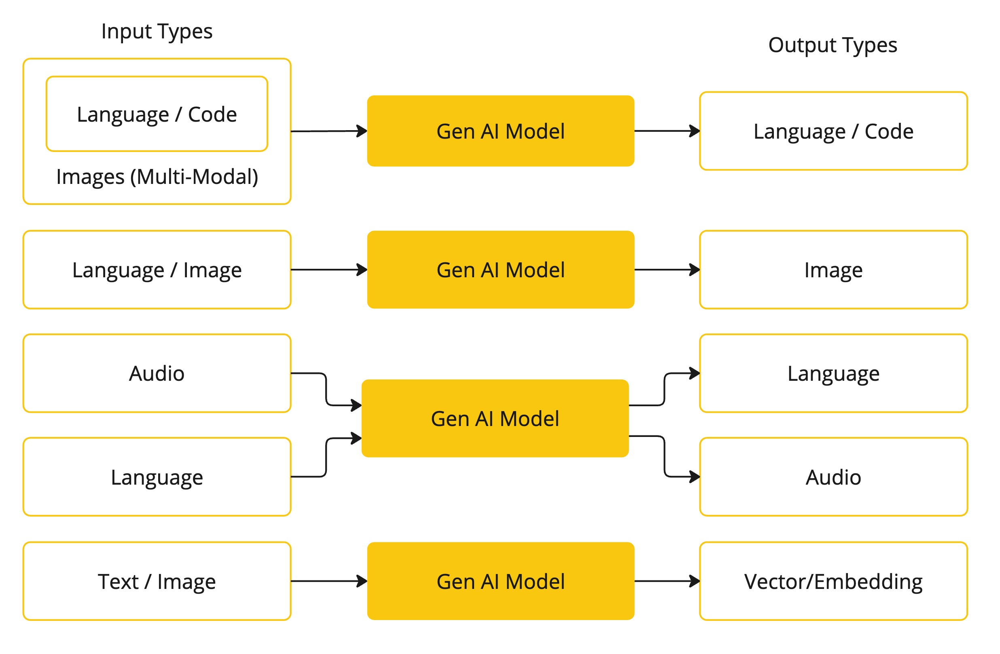
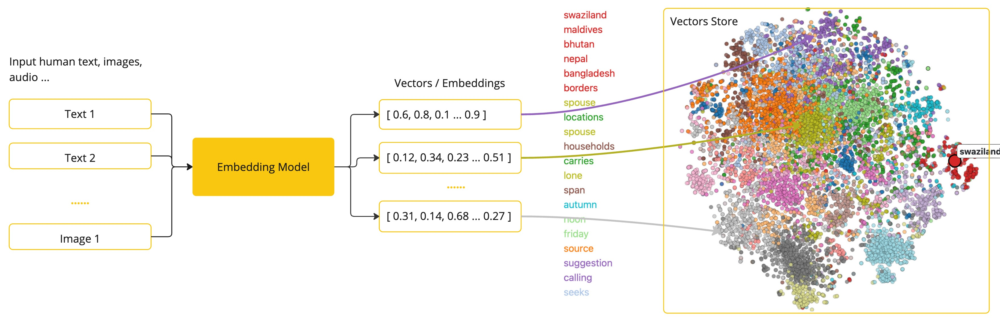
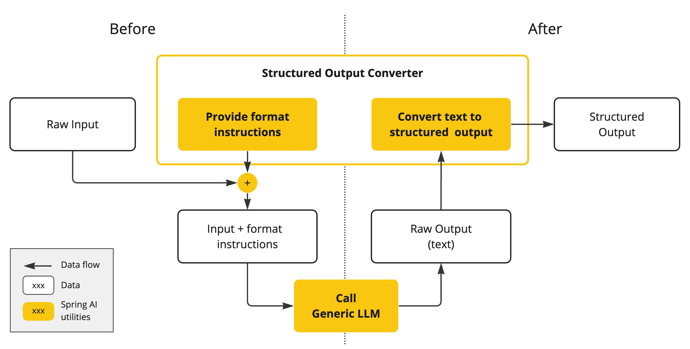
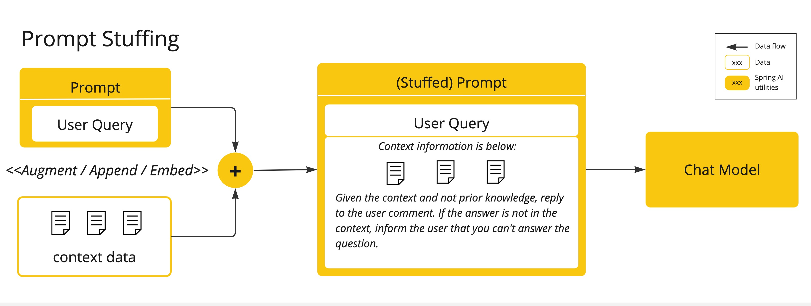
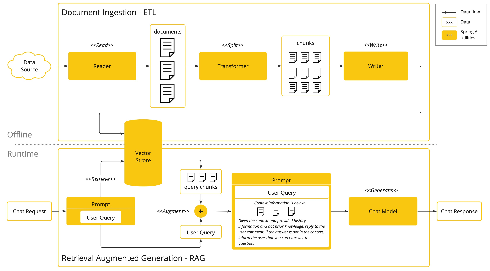
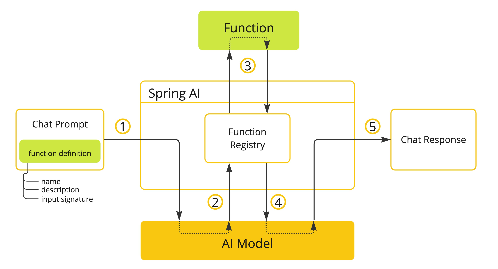

## Conceitos de IA

### Modelos

Os modelos de IA são algoritmos projetados para processar e gerar informações, muitas vezes imitando funções cognitivas
humanas. Ao aprender padrões e insights a partir de grandes conjuntos de dados, esses modelos podem fazer previsões,
gerar textos, imagens ou outros tipos de saída, aprimorando diversas aplicações em várias indústrias.

Existem diferentes tipos de modelos de IA, cada um adequado para um caso de uso específico. Enquanto o ChatGPT e suas
capacidades de IA generativa têm cativado os usuários através da entrada e saída de texto, muitos modelos e empresas
oferecem entradas e saídas diversas. Antes do ChatGPT, muitas pessoas se fascinavam com modelos de geração de texto para
imagem, como Midjourney e Stable Diffusion.

A tabela a seguir categoriza vários modelos com base nos tipos de entrada e saída:




### Tipos de Modelos

Atualmente, o Spring AI suporta modelos que processam entrada e saída como linguagem, imagem e áudio. A última linha da
tabela anterior, que aceita texto como entrada e produz números como saída, é mais comumente conhecida como "embedding"
de texto e representa as estruturas de dados internas usadas em um modelo de IA. O Spring AI suporta embeddings para
casos de uso mais avançados.

O que diferencia modelos como o GPT é sua natureza pré-treinada, como indicado pelo "P" em GPT—Chat Generative
Pre-trained Transformer. Esta característica de pré-treinamento transforma a IA em uma ferramenta geral para
desenvolvedores que não requer um extenso conhecimento em aprendizado de máquina ou treinamento de modelos.

### Prompts

Prompts servem como base para as entradas baseadas em linguagem que guiam um modelo de IA a produzir saídas específicas.
Para quem está familiarizado com o ChatGPT, um prompt pode parecer apenas o texto inserido em uma caixa de diálogo que é
enviado para a API. No entanto, ele abrange muito mais do que isso. Em muitos modelos de IA, o texto do prompt não é
apenas uma string simples.

A API do ChatGPT possui múltiplas entradas de texto dentro de um prompt, sendo cada entrada de texto atribuída a um
papel. Por exemplo, há o papel do sistema, que informa ao modelo como se comportar e define o contexto da interação. Há
também o papel do usuário, que é tipicamente a entrada do usuário.

Criar prompts eficazes é tanto uma arte quanto uma ciência. O ChatGPT foi projetado para conversas humanas, o que é uma
grande diferença de usar algo como SQL para "fazer uma pergunta". Deve-se comunicar com o modelo de IA como se estivesse
conversando com outra pessoa.

Tamanha é a importância desse estilo de interação que o termo "Engenharia de Prompts" surgiu como uma disciplina
própria. Há uma crescente coleção de técnicas que melhoram a eficácia dos prompts. Investir tempo na elaboração de um
prompt pode melhorar drasticamente a saída resultante.

Compartilhar prompts tornou-se uma prática comum, e há uma pesquisa acadêmica ativa sendo realizada sobre este assunto.
Como exemplo de quão contra-intuitivo pode ser criar um prompt eficaz (por exemplo, contrastando com SQL), um artigo de
pesquisa recente descobriu que um dos prompts mais eficazes que você pode usar começa com a frase: "Respire fundo e
trabalhe nisso passo a passo". Isso deve lhe dar uma indicação de por que a linguagem é tão importante. Ainda não
entendemos completamente como fazer o uso mais eficaz das iterações anteriores desta tecnologia, como o ChatGPT 3.5,
quanto mais as novas versões que estão sendo desenvolvidas.

### Templates de Prompt

Criar prompts eficazes envolve estabelecer o contexto da solicitação e substituir partes da solicitação com valores
específicos da entrada do usuário.

Esse processo usa mecanismos de template baseados em texto tradicional para criação e gerenciamento de prompts. O Spring
AI utiliza a biblioteca OSS StringTemplate para este propósito.

Por exemplo, considere o template de prompt simples:

```
Conte-me uma piada {adjetivo} sobre {conteúdo}.
```

No Spring AI, templates de prompt podem ser comparados ao "View" na arquitetura Spring MVC. Um objeto modelo,
tipicamente um `java.util.Map`, é fornecido para preencher os espaços reservados dentro do template. A string "
renderizada" torna-se o conteúdo do prompt fornecido ao modelo de IA.

Há considerável variabilidade no formato específico dos dados do prompt enviados ao modelo. Inicialmente começando como
strings simples, os prompts evoluíram para incluir múltiplas mensagens, onde cada string em cada mensagem representa um
papel distinto para o modelo.

### Embeddings

Embeddings são representações numéricas de textos, imagens ou vídeos que capturam relações entre as entradas.

Os embeddings funcionam convertendo texto, imagem e vídeo em arrays de números de ponto flutuante, chamados de vetores.
Esses vetores são projetados para capturar o significado dos textos, imagens e vídeos. O comprimento do array de
embedding é chamado de dimensionalidade do vetor.

Calculando a distância numérica entre as representações vetoriais de dois pedaços de texto, uma aplicação pode
determinar a similaridade entre os objetos usados para gerar os vetores de embedding.



Como desenvolvedor Java explorando IA, não é necessário compreender as teorias matemáticas intrincadas ou as
implementações específicas por trás dessas representações vetoriais. Uma compreensão básica de seu papel e função dentro
dos sistemas de IA é suficiente, especialmente ao integrar funcionalidades de IA em suas aplicações.

Embeddings são particularmente relevantes em aplicações práticas como o padrão de Geração Aumentada por Recuperação (
RAG). Eles permitem a representação de dados como pontos em um espaço semântico, que é semelhante ao espaço 2-D da
geometria euclidiana, mas em dimensões mais altas. Isso significa que, assim como pontos em um plano na geometria
euclidiana podem estar próximos ou distantes com base em suas coordenadas, em um espaço semântico, a proximidade dos
pontos reflete a similaridade no significado. Frases sobre tópicos semelhantes são posicionadas mais próximas nesse
espaço multidimensional, assim como pontos próximos em um gráfico. Essa proximidade ajuda em tarefas como classificação
de texto, busca semântica e até recomendações de produtos, pois permite que a IA discirna e agrupe conceitos
relacionados com base em sua "localização" nesse expandido espaço semântico.

### Tokens

Tokens servem como os blocos de construção de como um modelo de IA funciona. Na entrada, os modelos convertem palavras
em tokens. Na saída, eles convertem tokens de volta em palavras.

Em inglês, um token corresponde aproximadamente a 75% de uma palavra. Para referência, as obras completas de
Shakespeare, totalizando cerca de 900.000 palavras, traduzem-se em aproximadamente 1,2 milhão de tokens.


Mais importante é que Tokens = Dinheiro. No contexto de modelos de IA hospedados, seus encargos são determinados pelo
número de tokens usados. Tanto a entrada quanto a saída contribuem para a contagem total de tokens.

Além disso, os modelos estão sujeitos a limites de tokens, que restringem a quantidade de texto processada em uma única
chamada de API. Esse limite é frequentemente chamado de 'janela de contexto'. O modelo não processa nenhum texto que
exceda esse limite.

Por exemplo, o ChatGPT3 tem um limite de 4K tokens, enquanto o GPT4 oferece opções variáveis, como 8K, 16K e 32K. O
modelo Claude AI da Anthropic apresenta um limite de 100K tokens, e uma pesquisa recente da Meta produziu um modelo com
limite de 1M tokens.

Para resumir as obras completas de Shakespeare com o GPT4, você precisa desenvolver estratégias de engenharia de
software para dividir os dados e apresentar os dados dentro dos limites da janela de contexto do modelo. O projeto
Spring AI ajuda você nessa tarefa.

### Saída Estruturada

A saída dos modelos de IA tradicionalmente chega como um `java.lang.String`, mesmo que você peça para a resposta ser em
JSON. Pode ser o JSON correto, mas não é uma estrutura de dados JSON. É apenas uma string. Além disso, pedir "por JSON"
como parte do prompt não é 100% preciso.

Essa complexidade levou ao surgimento de um campo especializado envolvendo a criação de prompts para obter a saída
desejada, seguido pela conversão da string resultante em uma estrutura de dados utilizável para integração de
aplicações.



### Arquitetura do Conversor de Saída Estruturada

A conversão de saída estruturada emprega prompts meticulosamente elaborados, muitas vezes necessitando de múltiplas
interações com o modelo para alcançar o formato desejado.

### Incorporando Seus Dados e APIs ao Modelo de IA

Como você pode equipar o modelo de IA com informações sobre as quais ele não foi treinado?

Note que o dataset do GPT 3.5/4.0 se estende apenas até setembro de 2021. Consequentemente, o modelo diz que não sabe a
resposta para perguntas que requerem conhecimento além dessa data. Um fato interessante é que esse dataset tem cerca de
650GB.

Existem três técnicas para personalizar o modelo de IA para incorporar seus dados:

1. **Fine Tuning**: Esta técnica tradicional de aprendizado de máquina envolve adaptar o modelo e mudar seus pesos
   internos. No entanto, é um processo desafiador para especialistas em aprendizado de máquina e extremamente intensivo
   em recursos para modelos como o GPT devido ao seu tamanho. Além disso, alguns modelos podem não oferecer essa opção.

2. **Prompt Stuffing**: Uma alternativa mais prática envolve incorporar seus dados dentro do prompt fornecido ao modelo.
   Dado os limites de tokens de um modelo, técnicas são necessárias para apresentar dados relevantes dentro da janela de
   contexto do modelo. Esta abordagem é coloquialmente chamada de "stuffing the prompt". A biblioteca Spring AI ajuda
   você a implementar soluções baseadas na técnica de "stuffing the prompt", também conhecida como Geração Aumentada por
   Recuperação

(RAG).



3. **Chamada de Função**: Esta técnica permite registrar funções personalizadas do usuário que conectam os modelos de
   linguagem grandes às APIs de sistemas externos. O Spring AI simplifica muito o código que você precisa escrever para
   suportar a chamada de funções.

### Geração Aumentada por Recuperação

Uma técnica chamada Geração Aumentada por Recuperação (RAG) surgiu para abordar o desafio de incorporar dados relevantes
nos prompts para respostas precisas do modelo de IA.

A abordagem envolve um modelo de programação estilo processamento em lote, onde o trabalho lê dados não estruturados de
seus documentos, transforma-os e, em seguida, os escreve em um banco de dados vetorial. Em um nível alto, isso é um
pipeline ETL (Extract, Transform and Load). O banco de dados vetorial é usado na parte de recuperação da técnica RAG.

Como parte da carga dos dados não estruturados no banco de dados vetorial, uma das transformações mais importantes é
dividir o documento original em partes menores. O procedimento de dividir o documento original em partes menores tem
duas etapas importantes:

1. Divida o documento em partes enquanto preserva as fronteiras semânticas do conteúdo. Por exemplo, para um documento
   com parágrafos e tabelas, deve-se evitar dividir o documento no meio de um parágrafo ou tabela. Para código, evite
   dividir o código no meio da implementação de um método.

2. Divida as partes do documento em partes cujo tamanho seja um pequeno percentual do limite de tokens do modelo de IA.

A próxima fase na RAG é processar a entrada do usuário. Quando uma pergunta do usuário precisa ser respondida por um
modelo de IA, a pergunta e todas as partes "similares" do documento são colocadas no prompt que é enviado ao modelo de
IA. Este é o motivo de usar um banco de dados vetorial. Ele é muito bom em encontrar conteúdo similar.



### Função de Chamada

Os Modelos de Linguagem Grandes (LLMs) são congelados após o treinamento, levando a um conhecimento desatualizado e
incapazes de acessar ou modificar dados externos.

O mecanismo de Função de Chamada aborda essas limitações. Ele permite registrar suas próprias funções para conectar os
modelos de linguagem grandes às APIs de sistemas externos. Esses sistemas podem fornecer aos LLMs dados em tempo real e
realizar ações de processamento de dados em seu nome.

O Spring AI simplifica muito o código que você precisa escrever para suportar a invocação de funções. Ele lida com a
conversa de invocação de funções para você. Você pode fornecer sua função como um `@Bean` e, em seguida, fornecer o nome
do bean da função nas opções de seu prompt para ativar essa função. Além disso, você pode definir e referenciar várias
funções em um único prompt.



### Avaliação das Respostas de IA

Avaliar efetivamente a saída de um sistema de IA em resposta às solicitações do usuário é muito importante para garantir
a precisão e a utilidade da aplicação final. Várias técnicas emergentes permitem o uso do próprio modelo pré-treinado
para esse fim.

Esse processo de avaliação envolve analisar se a resposta gerada alinha-se com a intenção do usuário e o contexto da
consulta. Métricas como relevância, coerência e precisão factual são usadas para medir a qualidade da resposta gerada
pela IA.

Uma abordagem envolve apresentar tanto a solicitação do usuário quanto a resposta do modelo de IA ao modelo,
questionando se a resposta está alinhada com os dados fornecidos.

Além disso, aproveitar as informações armazenadas no banco de dados vetorial como dados suplementares pode melhorar o
processo de avaliação, auxiliando na determinação da relevância da resposta.

O projeto Spring AI atualmente fornece alguns exemplos básicos de como você pode avaliar as respostas na forma de
prompts para incluir em um teste JUnit.