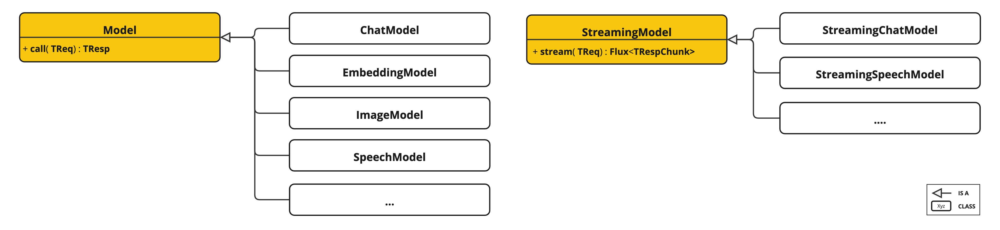
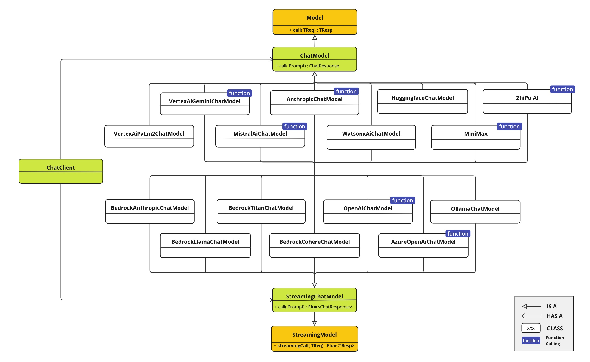
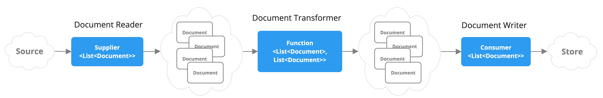

## Introdução à API do Spring AI

A API do Spring AI abrange uma ampla gama de funcionalidades. Cada recurso principal é detalhado em sua própria seção
dedicada. Para fornecer uma visão geral, as seguintes funcionalidades chave estão disponíveis:

### API de Modelos de IA

API de Modelos Portáteis para provedores de IA em Chat, Texto para Imagem, Transcrição de Áudio, Texto para Fala e
modelos de Embeddings. São suportadas opções de API síncrona e de stream. Também é possível acessar funcionalidades
específicas dos modelos.

#### Hierarquia de Modelos

Com suporte para Modelos de IA de OpenAI, Microsoft, Amazon, Google, Amazon Bedrock, Hugging Face e mais.

### API de Armazenamento Vetorial

API Portátil de Armazenamento Vetorial entre vários provedores, incluindo uma nova API de filtro de metadados semelhante
ao SQL que também é portátil. Suporte para 14 bancos de dados vetoriais estão disponíveis.

### API de Chamada de Função

Chamada de função. O Spring AI facilita a invocação do objeto POJO `java.util.Function` pelo modelo de IA.

#### Chamada de Função

Consulte a documentação de Chamada de Função do Spring AI para mais detalhes.

### Configuração Automática

Configuração Automática do Spring Boot e Starters para Modelos de IA e Armazenamentos Vetoriais.

### Engenharia de Dados ETL

Framework ETL para Engenharia de Dados. Isso fornece a base para carregar dados em um banco de dados vetorial, ajudando
a implementar o padrão de Geração Aumentada por Recuperação (RAG), que permite incorporar seus dados na resposta do
modelo de IA.

## Recursos Detalhados

### Clientes de Completude de Chat do Spring AI

Oferece suporte a modelos de completude de chat de diversos provedores de IA.

### ETL Pipeline

Permite a extração, transformação e carregamento de dados em um banco de dados vetorial, facilitando a integração de
seus dados com os modelos de IA para melhorar a precisão e relevância das respostas geradas.

---

Para mais detalhes, consulte a documentação específica de cada funcionalidade mencionada.